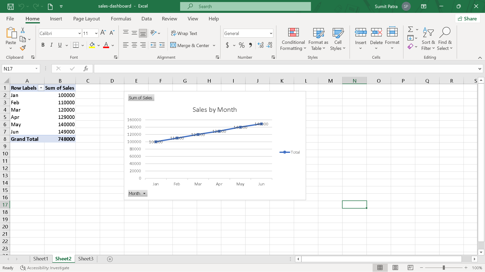
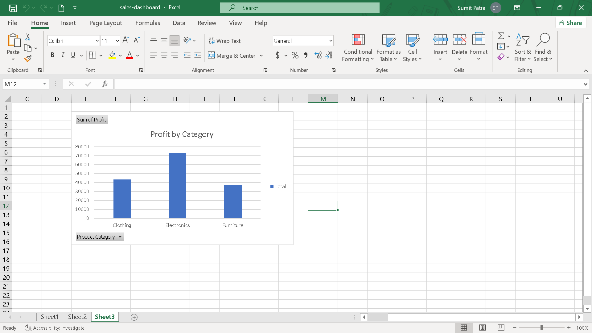

📊 Excel Sales Dashboard

🔹 Overview
This project analyzes sales and profit data across different months, categories, and regions.

🔹 Dataset Details
- Time Period: Jan to Jun
- Categories: Electronics, Clothing, Furniture
- Regions: East, West, North, South

🔹 Tools Used
- Microsoft Excel

🔹 Key Insights
- Electronics category has highest sales
- Sales are increasing month by month
- Profit trend follows sales growth

🔹 Project Purpose
To demonstrate data analysis and visualization skills using Excel.

🔗 File Included
- sales-dashboard.xlsx

📊 Dashboard Preview

Sales by Month

Profit by Category

